## 开放场景的身份证件定位方法

### 1. 问题描述

​		这里所说的“身份证件”是指具有头像照片和文字描述的卡片式证件，如：二代身份证、社保卡、医保卡、工牌等。

​		在传统需要对身份证件进行扫描识别的场景，通常使用平板扫描或高拍仪等设备进行图像采集，以确保对扫描或拍照的光照、背景、文字方向等进行有效控制，从而有助于后续对身份证件上的文字和图片进行识别。我们可以将此类场景定义为“封闭场景”的图像采集。在当前移动互联网时代，许多需要进行图像采集的场景，例如使用各类手机App或微信公众号时，通常需要使用手机或平板设备的拍照功能进行采集，因而对清晰度、环境光、背景、手持遮挡、摆放方向、倾斜角度等条件不能进行统一的控制。此类对外部条件不可控的图像采集场景，我们定义为“开放场景”。传统的机器学习方法可以完成大部分“封闭场景”的扫描识别任务，而对“开放场景”的扫描识别则不能达到实用的性能和结果。

​		目前业务系统中最常见的“开放场景”应用是：用户通过手机对身份证件进行拍照上传，系统对上传的证件照片识别出身份信息，为用户自动填写相关的个人身份信息，例如姓名、出生年月、身份证号等，从而免去了用户手工输入的麻烦。而在此类开放场景中拍摄的证件照片，通常因为上述不可控的因素，导致不能有效对身份证件进行定位、检测和识别。

​		因此，本方案提出了一个应用于开放场景的身份证件定位方法，通过使用深度神经网络，对输入的图片进行计算和处理，定位身份证件在原始图像中的位置和方向，经过调整后进一步定位身份证件上文字信息的位置。这些位置信息是后续对文字和头像照片进行识别的重要前提条件。

### 2. 方法概述

#### 主要步骤：

1. 将原始图像转换为模型张量作为输入
2. 使用证件定位模型进行推理计算，获得证件和头像照片的位置信息，并进行相应调整
3. 从原始图片截取证件图片，转换为模型张量作为输入
4. 使用CTPN网络模型进行文本检测，获得文字序列的位置信息，并进行相应调整
5. 截取文字图像

#### 过程示例：

|                    原始图片                     |                  定位证件和头像照片                  |                     定位文本                     |
| :---------------------------------------------: | :----------------------------------------------: | :----------------------------------------------: |
| 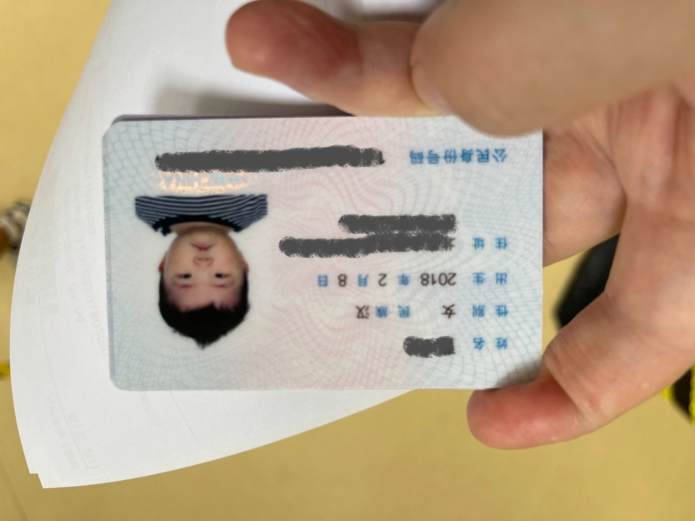 | 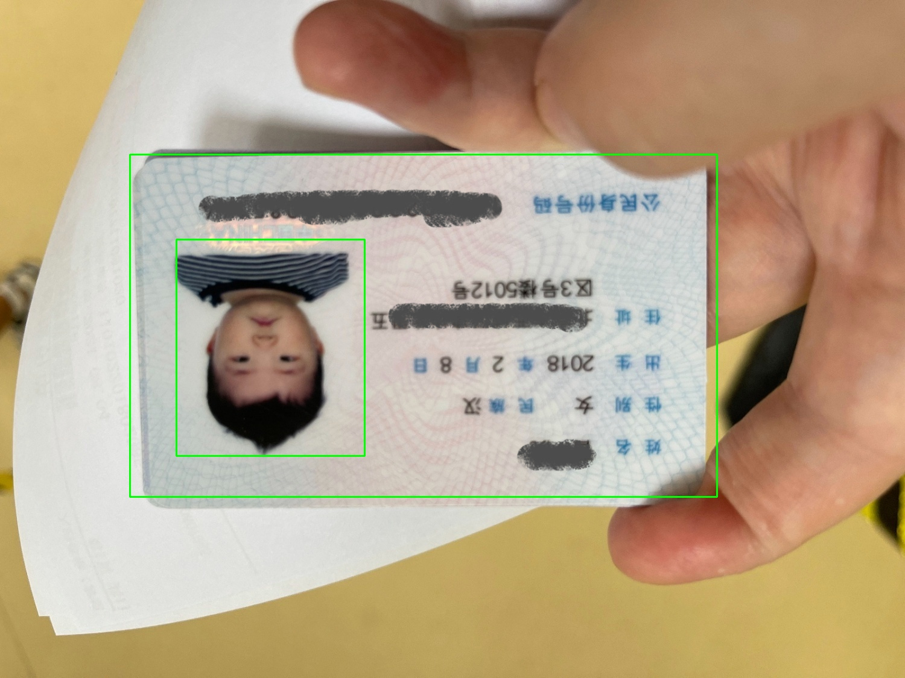 | 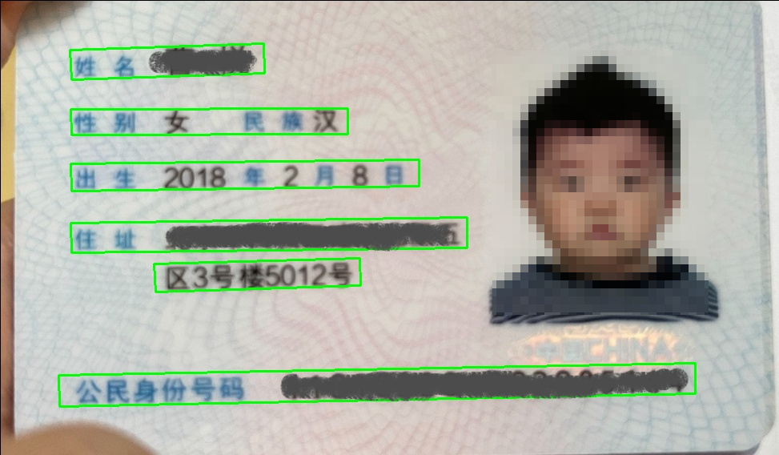 |
| 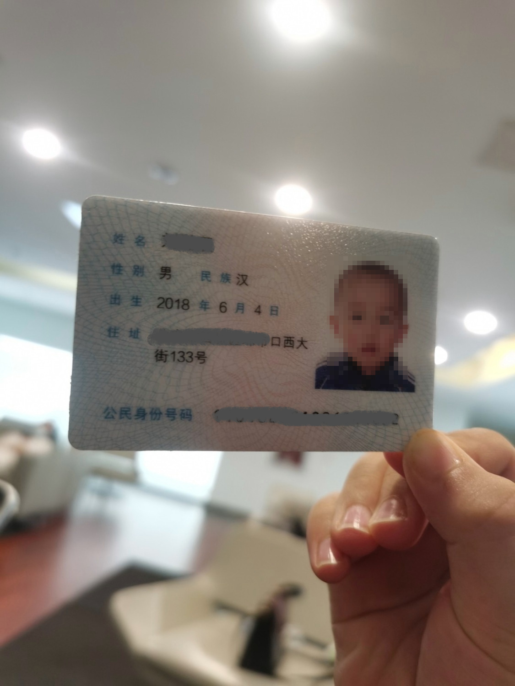 | 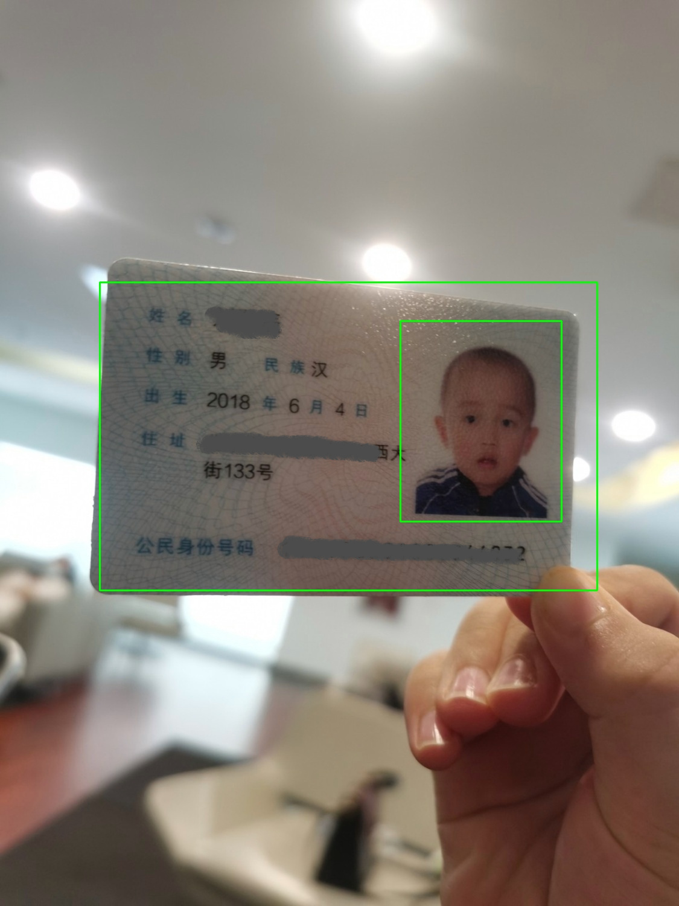 | 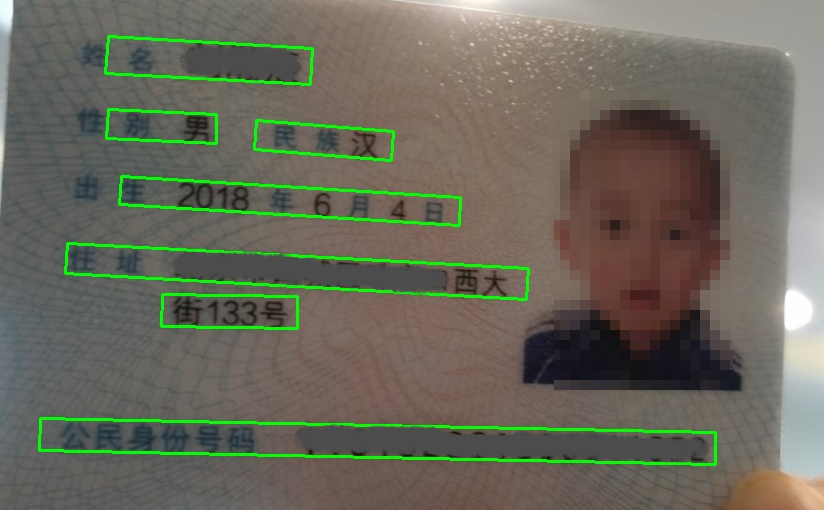 |
| 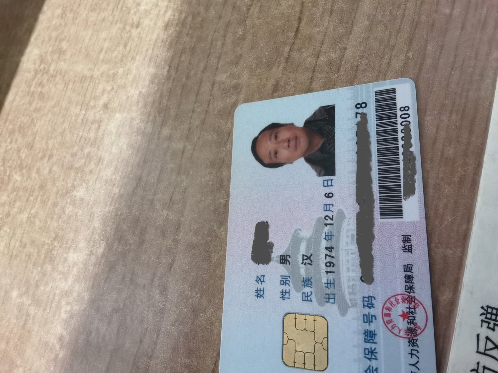 | 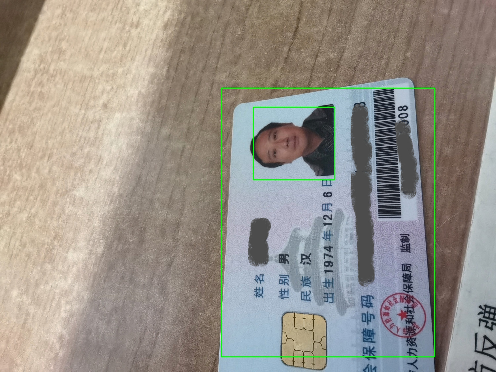 | 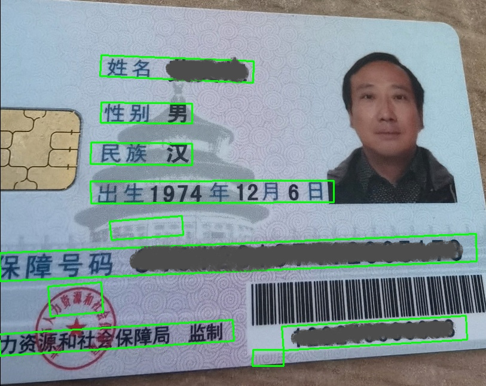 |

### 3. 定位证件和头像的方法

#### 定位算法		

​		证件和头像定位使用基于卷积神经网络的深度学习模型，从输入的原始图像中定位出证件的对角坐标和头像照片的对角坐标。因为头像在证件上的位置是相对固定和已知的，因此通过头像坐标和证件坐标可以计算出证件在原始图像中的摆放方向，从而可以将证件调整为正常视角。

​		模型输入为使用原始图像生成的张量，尺寸调整为224\*224\*3，数值做标准化处理（除以255）。模型输出为4个预测坐标点（8个预测值），其中2个坐标为证件的左上角和右下角坐标，另2个坐标为头像照片的左上角和右下角坐标。4个坐标点均为标准化的数值（数值区间0-1），将坐标值乘以原始图片的长宽值后，可以恢复为原始图片上的坐标。

​		模型骨干网络基于VGG或ResNet神经网络模型。其中VGG网络是牛津大学视觉几何小组在2014提出的深度卷积网络（arXiv: 1409.1556 [Very Deep Convolutional Networks for Large-Scale Image](https://arxiv.org/abs/1409.1556)），主要工作是证明了增加网络的深度能够在一定程度上影响网络最终的性能。ResNet是“深度残差网络”的英文简写，由何凯明在2015年提出（arXiv: 1512.03385 [Deep Residual Learning for Image Recognition](https://arxiv.org/abs/1512.03385)），深层网络在训练过程中存在着梯度消失或者爆炸的问题，导致深度模型难于训练，残差网络概念的提出解决了深度CNN模型难训练的问题。

​		在骨干网络后，先将多维张量展平为一维向量，然后接全连接网络，用于输出8个预测值。其中Dropout用于缓解训练中的参数过拟合现象。具体模型设计如下：

| 定位模型（自上而下）：                             |
| -------------------------------------------------- |
| 输入层（ 三维张量，尺寸[224, 224, 3] ）            |
| VGG或ResNet骨干网络                                |
| Flatten展平层（多维张量展平为一维向量）            |
| 全连接层（128维输出，激活函数使用ReLU或LeakyReLU） |
| Dropout层                                          |
| 全连接层（64维输出，激活函数使用ReLU或LeakyReLU）  |
| Dropout层                                          |
| 全连接层（32维输出，激活函数使用ReLU或LeakyReLU）  |
| Dropout层                                          |
| 全连接输出层（8维输出，激活函数使用Sigmoid）       |

​		在骨干网络选择上的考虑：在工程实践中，考虑到用户体验，整个证件识别过程不能耗时太久，因此卡片定位过程需要快速完成。同时，因为卡片定位只是一次粗略的定位，主要目的是定位和确定卡片的方向，后续还有精确的文字定位，因此卡片定位对精度要求不是非常高，从而不需要使用过于复杂的网络结构。VGG和ResNet都是相对比较基础的卷积神经网络，尤其VGG网络比较简洁，非常适合要求快速且相对精度要求不高的图像处理应用。

#### 模型训练

​		训练数据由输入图像和目标坐标构成。训练数据的输入图片为包含身份证件的各类图片，应该尽可能包括各类情况，例如：不同方向、不同背景、不同光照条件、手持、把握等各类情景。因为最终会通过头像在证件上的相对位置进行证件方向的判断，因此训练图片中的证件尽量应为同一类证件，即头像在证件上的位置应相对一致，例如二代身份证、社保卡、医保卡等证件，证件卡片均为横向，头像照片均位于证件的右侧位置。

​		训练数据的目标数据为4个坐标，其中2个坐标为证件的左上角和右下角坐标，另2个坐标为头像照片的左上角和右下角坐标。每个图片对应4个坐标即8个数值。

​		因为模型最终输出是一系列坐标，可以理解为数值回归过程，因此模型训练过程使用均方差（MSE）损失函数。可以使用梯度下降算法或自适应学习率的Adam算法等优化算法进行权重更新和模型训练。

#### 使用模型进行定位

​		在使用模型时，将输入原始图像转换为张量后输入模型，模型会预测出8个数值，将8个数值分别乘以原始图片的长宽值后，即可得到证件方框和头像照片方框的对角坐标点。具体过程如下：

(1) 设输入图像为三维向量M，M的尺寸为 W\*H\*3，其中W为图像的宽，H为图像的高；

(2) 将M转换为尺寸为224\*224\*3的浮点元素的向量M1，并进行标准化 M2 = M1/255.0

(3) 将M2作为模型输入，进行模型推理计算，得到模型输出 Y = (y1,y2,y3,y4,y5,y6,y7,y8)，其中Y是一维向量

(4) 由Y可以到:

​	证件对角点坐标 P1(x,y)=(y1\*W,y2\*H), P2(x,y)=(y3\*W,y4\*H)

​	头像照片对角点坐标 P3(x,y)=(y5\*W,y6\*H), P4(x,y)=(y7\*W,y8\*H)

​		假设已知身份证件的头像照片在证件的右侧。依据上述两个预测框的坐标点可以计算出证件在原始图片中的位置和方向。

(5) 判断证件方向：如果 P2(x)-P1(x)<P2(y)-P1(y), 则 证件为竖向，否则为横向

(6) 可计算得到：

​	证件的中心坐标 C1(x,y)= ((P2(x)-P1(x))/2+P1(x), (P2(y)-P1(y))/2+P1(y))

​	头像照片中心坐标 C2(x,y)=((P4(x)-P3(x))/2+P3(x), (P4(y)-P3(y))/2+P3(y))

(7) 当证件是横向时，如果C1(x)>C2(x), 则证件需要顺时针旋转角度 R=180°，否则 R=0°

(8) 当证件是竖向时，如果C1(y)>C2(y), 则证件需要顺时针旋转角度 R=90°，否则 R=270°

​		至此，已经获得了证件的对角点坐标（P1, P2）、头像照片的对角点坐标（P3, P4）、顺时针旋转角度（R）。依据这些数据，可以从原始图像M中截取出横向视角的身份证件图像及头像照片。其中，截取出的证件图像可以用于下一步文本检测。

### 4. 检测文本的方法

#### 基于CTPN算法

​		CTPN算法是2016年提出的一种文字检测算法（arXiv 1609.03605 [Detecting Text in Natural Image with Connectionist Text Proposal Network](https://arxiv.org/abs/1609.03605)）。CTPN结合了CNN与LSTM深度神经网络，能有效的检测出复杂场景的横向分布的文字。因为上述证件定位过程，已经将身份证件图像调整为横向视角，因此可以与CTPN检测横向文字的特性匹配。

CTPN算法检测文本的过程，简要分为：（详细算法可参考原始论文）

1. 使用VGG网络和双向LSTM网络进行特征提取、分类和回归计算，预测可能为文本的微分框（anchor）
2. 根据微分框的评分进行筛选，将连续的微分框合并生成选择框（text proposal）
3. 用文本线构造的算法，将得到的选择框合并成文本框

|                   生成微分框                    |                 筛选生成选择框                  |                    生成文本框                    |
| :---------------------------------------------: | :---------------------------------------------: | :----------------------------------------------: |
| 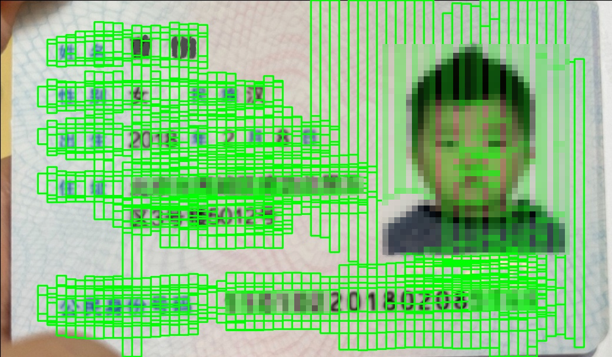 | 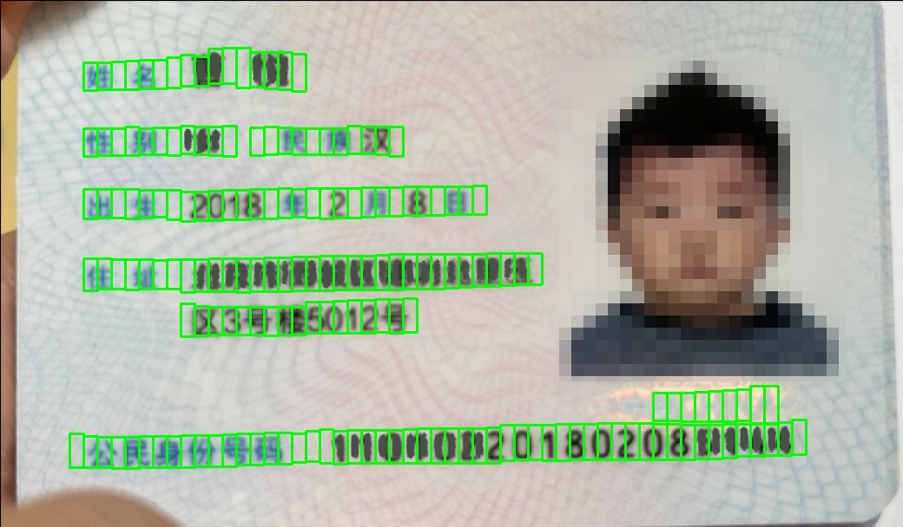 |  |

#### CTPN模型的训练

​		为了减少工作量，模型训练图片可以使用开源数据集，训练过程按照原始论文的方法进行。开源数据的优点是已经进行了文本框位置等数据标注，节约了大量标注工作量。开源数据集的缺点，因为不是专门针对身份证件的文本检测，开源数据集通常包括各类场景的文本图像，因此对一些特定条件的图像，文本检测性能不是非常好。因此，如果在对模型性能要求非常高的应用场景，需要使用自定义数据集进行训练。需要收集大量的各类身份证件图像并进行人工标注，再使用此自定义的数据集进行训练，以获得针对特定证件上文本检测更好的模型性能。

#### 使用CTPN模型进行文本检测

​		CTPN算法的输入图片尺寸为长不大于1200，宽不大于600的图片。CTPN算法最终输出是若干个文本框的4个顶点坐标（8个数值）。

​		在开放场景下，文本方向会存在一点的倾斜角度，因此还需根据文本框的坐标对截取出的文本图像进行角度修正，以保证文本的水平方向，利于提高后续文本识别的准确率。具体过程如下：

(1) 设输入图像为三维向量M3，M3的尺寸为 W2\*H2\*3，其中W2为图像的宽，H2为图像的高；

(2) 将M3转换为尺寸不大于为1200\*600\*3的三维浮点元素的向量M4，并进行标准化 M5 = M4/255.0

(3) 将M5作为CTPN模型输入，进行模型推理和文本框筛选合并计算，最终得到一组文本框坐标：

​	B=(b1, b2, ... ,bn), 其中 bn=(x1, y1, x2, y2, x3, y3, x4, y4) 为一个8个元素的向量，分别表示一个文本框的左上角、右上角、右下角、左下角4个顶点坐标；

(4) 将B的坐标恢复为原始图像的坐标系，形成新的向量 BB=(bb1, bb2, ... ,bbn)，其中

​	bbn(xn) = bn(xn)/1200\*W2

​	bbn(yn) = bn(yn)/600\*H2

(5) 计算文本框坐标反正切值 A=atan2(bn(y2)-bn(y1), bn(x2)-bn(x1))

(6) 计算文本框需旋转角度D：如果 A>0，则 D=A\*360/(2\*PI)，否则 D=(2\*PI+A)\*360/(2\*PI)

​		此时，可以使用bbn的4个顶点坐标从输入图像M3上截取文字，然后旋转角度D，就可以得到水平状态的文字，用于后续进行文本识别。如下示例：

| 文本截图（已进行角度修正）                            |
| ----------------------------------------------------- |
| 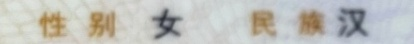 |
| 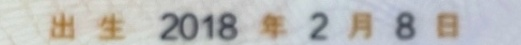 |
| 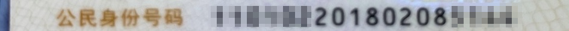 |

### 5. 结论

​		至此，以一个开放场景采集的身份证件图像作为输入，经过定位模型定位、CTPN文本检测及相应图像调整和截取，可以得到从证件图像上截取的文字方向呈水平状态的文字截图，可以用于下一步进行文本识别。

